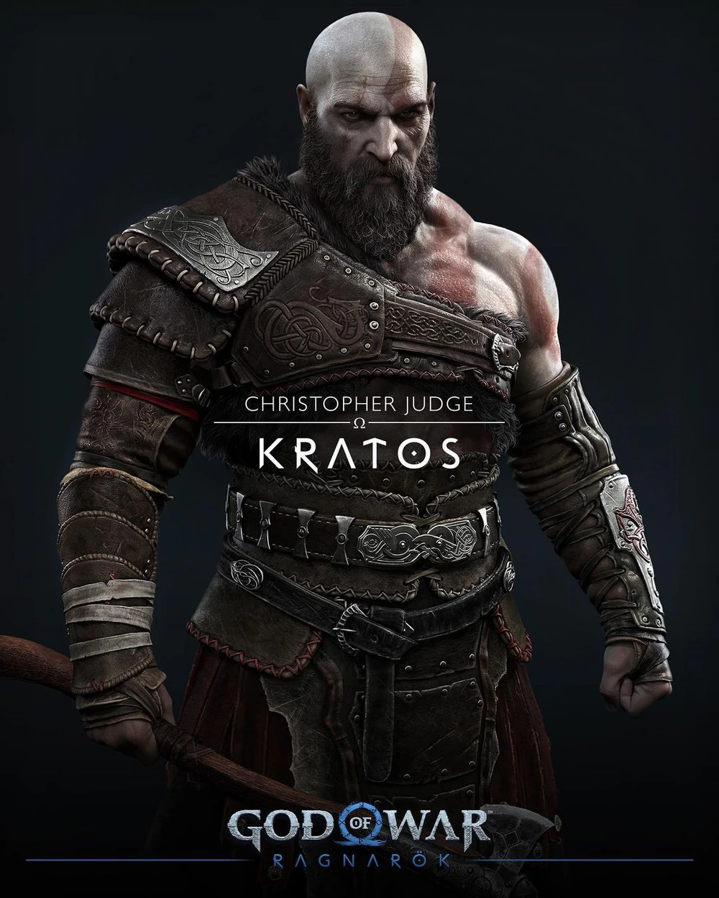
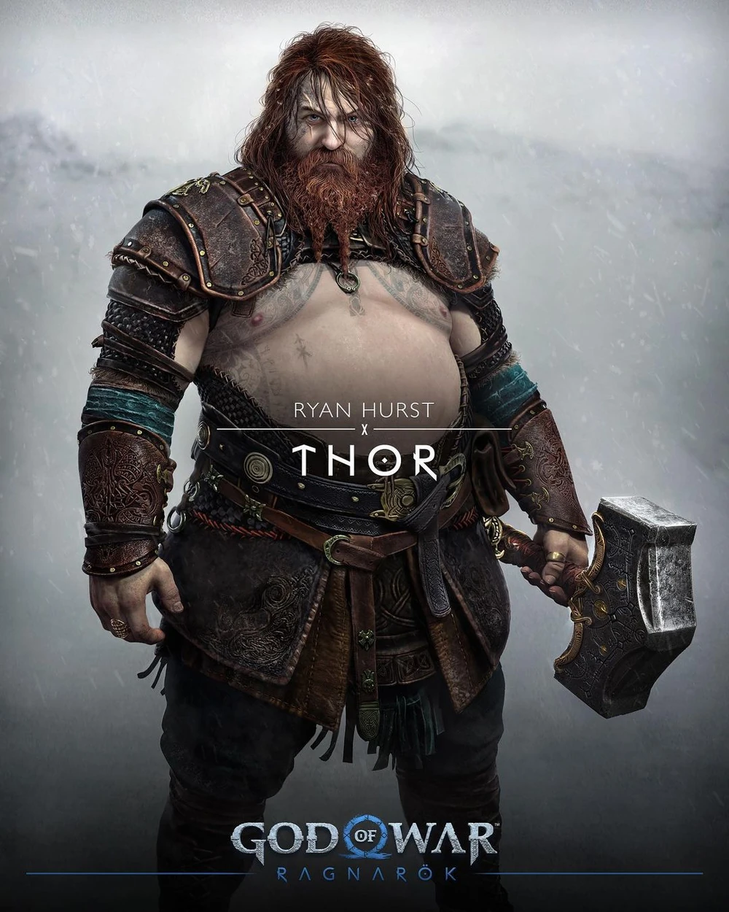
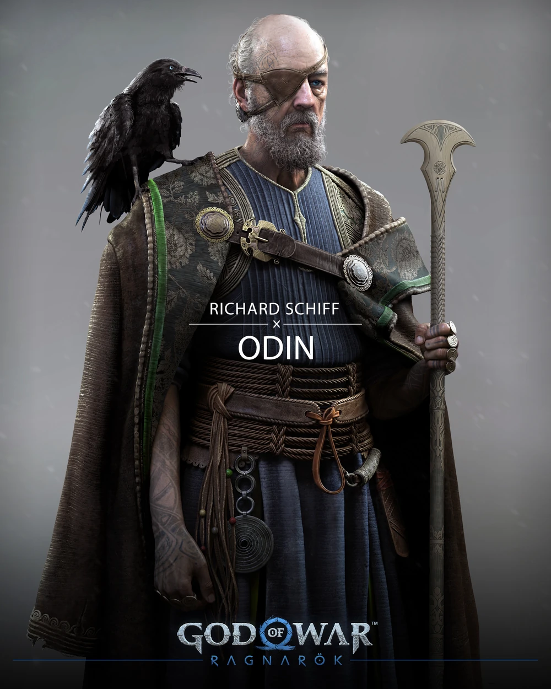
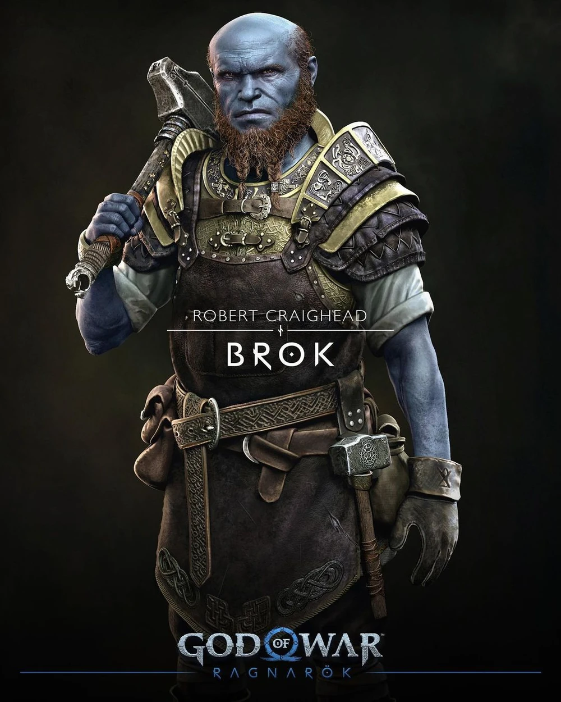
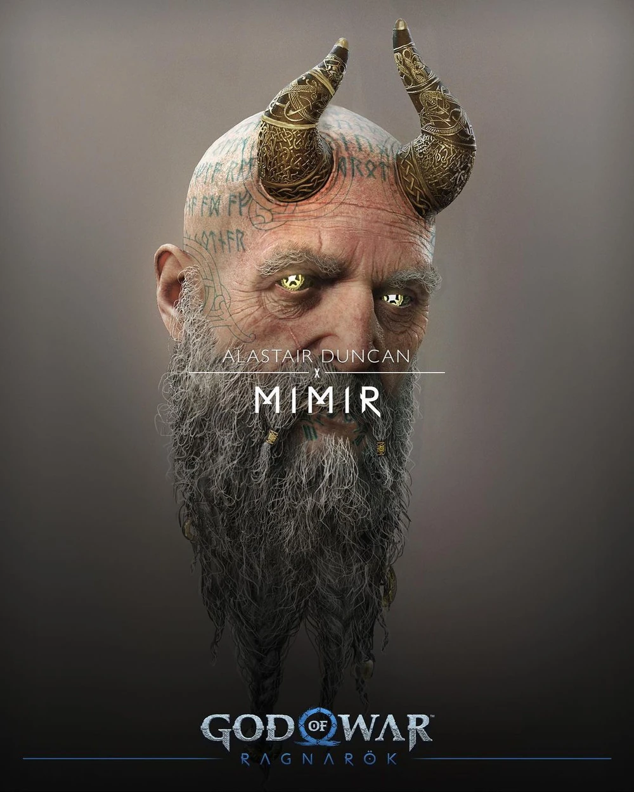

# BIDAR - Codeit 12기 Part3 중급 프로젝트

## 프로젝트 개요

- 지금까지 학습하신 자연어처리 및 LLM 지식들을 토대로, **RAG 시스템을 구축하여 복잡한 형태의 기업 및 정부 제안요청서(RFP) 내용을 효과적으로 추출하고 요약하여 필요한 정보를 제공**하는 서비스를 만들어봅시다.
- 여러분들을 **B2G 입찰지원 전문 컨설팅 스타트업 – ‘입찰메이트’**의 엔지니어링 팀이라고 가정해 볼게요.
    - ‘입찰메이트’는 공공입찰 컨설팅 서비스를 제공하는 스타트업입니다.
    - 하루 수백건의 RFP(제안요청서)가 나라장터 등에서 올라오게 되는데, 한 요청서당 수십 페이지가 넘는 걸 기업 담당자들이 일일이 다 읽어볼 순 없겠죠.<br>
      ‘입찰메이트’는 쏟아져나오는 요청서 가운데서 고객사에게 딱 알맞는 입찰 기회를 빠르게 찾아 고객사에게 추천하는 비즈니스를 하고 있습니다.<br>
      따라서 ‘입찰메이트’의 컨설턴트들은 **RFP의 주요 요구 조건, 대상 기관, 예산, 제출 방식 등** 중요한 정보를 핵심만 빠르게 파악한 뒤, 고객사들에게 추천하여 컨설팅까지 이어질 수 있는 기회를 만들어야합니다.
    - ‘입찰메이트’의 엔지니어링 팀은 **사용자의 요청에 따라 RFP 문서의 내용을 효과적으로 추출하고 요약하여 필요한 정보를 제공할 수 있는 사내 RAG 시스템을 구현**하는 미션을 부여 받았습니다.<br>
      그렇게 되면 ‘입찰메이트’의 컨설턴트들이 수십 페이지가 넘어가는 제안서를 일일이 들여다볼 일은 없어지고, 컨설팅 업무에 최대한 집중할 수 있겠네요.
- 여러분들은 100개의 실제 RFP 문서와 각각의 메타데이터를 제공받을 예정입니다. 다양한 자연어 처리 모델들로 실험하여 해당 문서들의 내용을 바탕으로 Q&A를 할 수 있는 시스템을 구축해보세요.<br>
  그리고 평가 방식이나 지표를 팀 별로 직접 선정하여 성능을 평가해보세요.<br>
  여러가지 의사 결정 과정이 모두 보고서와 발표에 드러나야 합니다.

## 1팀 RAGnarok

<div align="center">
    <table>
        <tr align="center">
            <td></td>
            <td></td>
            <td></td>
            <td></td>
            <td></td>
        </tr>
        <tr align="center">
            <td><b>최승원</b></td>
            <td><b>이형기</b></td>
            <td><b>서동혁</b></td>
            <td><b>김완수</b></td>
            <td><b>권순균</b></td>
        </tr>
        <tr align="center">
            <td>
                <br>
                <br>
                
            </td>
            <td>
                
            </td>
            <td>
                
            </td>
            <td>
                
            </td>
            <td>
                
            </td>
        </tr>
    </table>
</div>

## 프로젝트 구조

```
BIDAR/
├── ai/           # 임베딩 생성, RAG 검색/생성, 모델 학습·추론 등 모델 관련 코드 전체
├── backend/      # FastAPI 기반 API 서버. 라우팅/요청 검증/응답 조합 담당, ai 패키지를 import해 사용
└── client/
    └── android/  # Android 클라이언트. 공고/문서를 선택해 챗봇에게 질의응답하는 앱
```

- **ai**: 텍스트 임베딩, 벡터 검색 및 LLM 응답 생성(RAG), 별도 예측 모델의 학습·추론, 원본 RFP 데이터를 색인 가능한 형태로 가공하는 ingestion 파이프라인을 포함합니다. `backend`가 로컬 편집 가능 설치로 의존성에 추가해 같은 프로세스 안에서 직접 호출합니다.
- **backend**: FastAPI 기반 API 서버로, 헬스체크·질의응답(`/chat`, SSE 스트리밍 지원)·문서 목록(`/documents`) 엔드포인트를 제공합니다. 요청을 받아 `services`에 위임하고, `services`가 `ai` 패키지의 함수를 호출해 결과를 조합합니다.
- **client/android**: BID + RADAR 컨셉의 Android 클라이언트로, Clean Architecture(`app`/`data`/`domain`) 스타일로 구성되어 있으며 Splash·Home·Chat·Setting 화면을 통해 문서 목록 조회와 챗봇 대화 기능을 제공합니다.

## 파트별 문서 링크

- [AI 모듈 문서](ai/README.md)
- [Backend 모듈 문서](backend/README.md)
- [Client 모듈 문서 (Android)](client/android/README.md)

## 최종 보고서

- [최종 보고서 파일 다운로드 (MyBOX)](https://naver.me/FM94v4hZ)

## 협업일지 링크

- [최승원 협업일지](https://charming-power-d0c.notion.site/3c7a35cd00a98059a800dc8cf0f6f03e?source=copy_link)
- [이형기 협업일지](https://charming-power-d0c.notion.site/3c7a35cd00a980e29d3edfac6a8c3239?source=copy_link)
- [서동혁 협업일지](https://charming-power-d0c.notion.site/3c7a35cd00a980d3be8dee2c9f6cccf0?source=copy_link)
- [김완수 협업일지](https://charming-power-d0c.notion.site/3c7a35cd00a98060835ae0f599c7152f?source=copy_link)
- [권순균 협업일지](https://charming-power-d0c.notion.site/3c7a35cd00a980acb9e8fa6e4bfa5ab5?source=copy_link)
